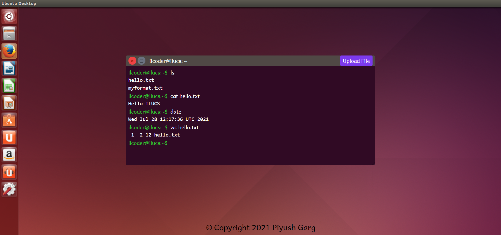

# **ILUCS**
ILUCS (IL Unix Command Simulator) is an online and free to use tool for simulating linux commands.

It can execute many basic commands like ls, pwd, date, cat, etc.

It also supports file upload for working with files.

Access live version of ILUCS at [https://ilucs.herokuapp.com/](https://ilucs.herokuapp.com/)

## **Technologies Used**
* HTML
* CSS, Tailwind CSS
* JavaScript, jQuery, TypeScript
* AdonisJS 5 Framework
* Edge Template Engine
* Node.js

## **Screenshots**




## **Deployment Platform**
>Heroku

## **Setup**
```
npm install
cp .env.example .env
node ace generate:key
#put proper value in .env file
```

## **Run in dev**
```
node ace serve --watch

# or

npm run dev
```

## **Run in production**
```
npm run build
npm run start

# or

npm run build
cd build
npm ci --prodution
node server.js
```

## **Deployment Steps**
```
1. Build the project using `npm run build`
2. Set up environment variables in Heroku project. (Don't set PORT variable as it is set by heroku itself).
3. Push the code to heroku project.
```
